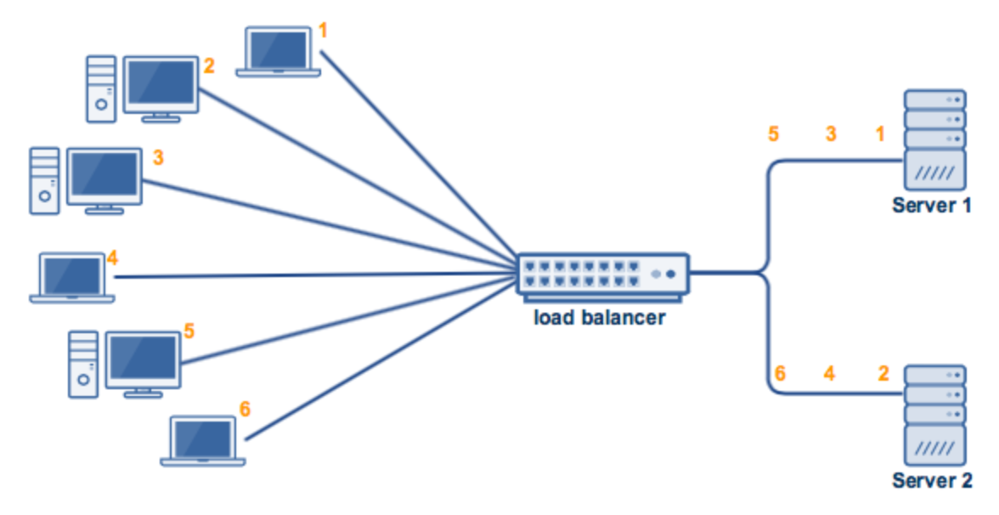
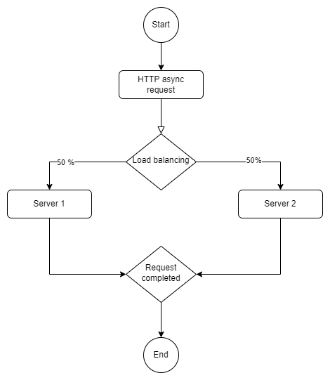

Task:

```
1. (0,5 balo) Parenkama reali sistema (procesas, elgsena) iš savo mokslo srities. 
Pateikiamas trumpas aprašas. Formuluojama hipotezė, problema, reiškinys, kas bus tiriama
2. (0,5 balo) Apibrėžiamas tam tikras sistemos abstrakcijos (detalumo) lygis. 
Tikslinama hipotezė, problema, reiškinys, kas bus tiriama
3. (2 balai) Formuluojamas konceptualus modelis, apibrėžiami modelio parametrai, 
imitavimo parametrai, tyrimo scenarijai, kintamieji
4. (2 balai) Sudaromas pusiau formalus (loginis) arba formalus modelis
5. (4 balai) Kompiuteryje realizuojamas imitacinis modelis:
   5.1. Imitacinis modelis (grafinis arba kodas) ir imitavimo parametrai bei kintamieji
   5.2. Įvesties ir išvesties analizė
   5.3  Verifikavimo atvejai
6. (1 balas) Daromos tyrimo išvados: atsakoma į iškeltą hipotezę, aptariamas reiškinys, 
jo jautrumas parametrams, aptariamos modelio validavimo galimybės ir pan.
7. (Taip / Ne) Paruošiama darbo ataskaita ir įkeliama į Moodle.
```

# Load balancing process

Load balancing is a term that refers to the process of distributing a set of jobs among a set of resources (computing units) with the goal of increasing the overall efficiency of their processing. Load balancing can improve response time and prevent some computing nodes from being overloaded while others remain idle.

{width=350px}

There are numerous load balancing algorithms, both dynamic and static (source - [cloudflare](https://www.cloudflare.com/learning/performance/types-of-load-balancing-algorithms/))

Dynamic: 

 * Least connection: Checks which servers have the fewest connections open at the time and sends traffic to those servers. This assumes all connections require roughly equal processing power.
* Weighted least connection: Gives administrators the ability to assign different weights to each server, assuming that some servers can handle more connections than others.
* Weighted response time: Averages the response time of each server, and combines that with the number of connections each server has open to determine where to send traffic. By sending traffic to the servers with the quickest response time, the algorithm ensures faster service for users.
* Resource-based: Distributes load based on what resources each server has available at the time. Specialized software (called an "agent") running on each server measures that server's available CPU and memory, and the load balancer queries the agent before distributing traffic to that server.

Static:

* Round robin: Round robin load balancing distributes traffic to a list of servers in rotation using the Domain Name System (DNS). An authoritative nameserver will have a list of different A records for a domain and provides a different one in response to each DNS query.
* Weighted round robin: Allows an administrator to assign different weights to each server. Servers deemed able to handle more traffic will receive slightly more. Weighting can be configured within DNS records.
* IP hash: Combines incoming traffic's source and destination IP addresses and uses a mathematical function to convert it into a hash. Based on the hash, the connection is assigned to a specific server.

To keep things simple, we are going to simulate a **random load balancing** process without assigning any weights to the servers (in this case, the specifications of the servers are equal). This algorithm connects clients and servers at random, i.e. by the use of an underlying random number generator. When a load balancer receives a huge number of requests, a Random algorithm is capable of evenly distributing the requests to the nodes. Thus, similar to Round Robin, the Random algorithm is acceptable for clusters of nodes with similar configurations (CPU, RAM, etc).

{width=350px}

Main modules for system realization:

* New async request
* Request assignment to the server 
* Request processing 
* Request completion

Events for formal model specification:

* New event in the load balancer
* Request processing in server 1
* Request processing in server 2

And discrete variables for the queue. 

X = $\emptyset$ , y = $\emptyset$ , E' = $\emptyset$

E'' = {$e_{1}''$, $e_{2}''$, $e_{3}''$}

where: 

* $e_{1}''$ - new request, processing time {$\small \phi_i$}
* $e_{2}''$ - processing on server 1, processing time {$\small \phi_j$}
* $e_{3}''$ - processing on server 2, processing time {$\small \phi_k$}


z($t_m$) = {in($t_m$), out($t_m$), $Q_1$($t_m$), $Q_2$($t_m$), w($e_{1}''$, $t_m$), w($e_{2}''$, $t_m$), w($e_{3}''$, $t_m$)}

### Hypothesis

**The random load balancing is ideally suited for servers that are comparable in their specifications and conduct the same work.**

### Simulation

For our simulation were are going to use [simmer](https://r-simmer.org/) package. The simmer does process-oriented and trajectory-based Discrete Event Simulation (DES). It is intended to be a general yet robust framework. A distinguishing feature of simmer is that it makes use of the concept of trajectory: a shared path in the simulation model for entities of the same type. It is rather flexible and straightforward to use, and makes use of the magrittr package's chaining/piping approach.

Both the task time (timeout) and arrival time are generated using the [rexp](https://stat.ethz.ch/R-manual/R-devel/library/stats/html/Exponential.html) function in R: a random generator for the exponential distribution with a provided rate rate.

```{r}
set.seed(404)
request_times <- rexp(10000, 0.1)
hist(request_times)
```
As illustrated in the process diagram above, the load balancer (server) contains two resources. Requests are routed to the server via the load balancer. While it makes sense to produce request time using an exponential distribution, we shall generate processing time using a normal distribution. Consider simulating a 40-request event and defining a pipeline. Each new request, job processing, and work completion are all logged. Given that the policy is written in C++ (as part of the simmer package), we will write our custom policy as a function that returns the server name.

```{r message=FALSE, warning=FALSE, cache=FALSE}
library(simmer)
set.seed(404)
request <-
  trajectory("Request load balancing") %>%
  log_("New Request") %>%
  set_attribute("start_time", function() {now(server)}) %>%
  simmer::select(function() {
    paste0("server", sample(1:2, 1, replace=T,prob=c(0.5,0.5)))
    }) %>%
  # simmer::select(c("server1", "server2"), policy = "random") %>%
  seize_selected() %>%
  log_(function() {paste("Waited: ", now(server) - get_attribute(server, "start_time"))}) %>%
  timeout(function() {rnorm(1, mean=10, sd=5)}) %>%
  release_selected() %>%
  log_(function() {paste("Finished: ", now(server))})

request_times <- rexp(40, 0.1)
server <-
  simmer("server") %>%
  add_resource("server1", 1) %>%
  add_resource("server2", 1) %>%
  add_generator("Request", request, function() {c(0, request_times, -1)}) 
```


Let's run the simulation!

```{r}
server %>% run() 
```
### Resource monitoring

Now we are going to generate a similar table as in the imitation example showed in class. 

```{r message=FALSE, warning=FALSE}
library(knitr)
library(tidyverse)
get_mon_arrivals(server) %>%
  mutate(service_start_time = end_time - activity_time) %>%
  arrange(start_time) %>%
  kable()
```

This could be presented for each server (resource):

```{r}
get_mon_resources(server) %>%
select(-c(queue_size, limit, replication, capacity)) %>%
  kable()
```

In a graphical depiction, each server's load may be clearly seen. This appears to be well-balanced, according to the graphical evidence. 

```{r message=FALSE, warning=FALSE}
library(simmer.plot)
plot(get_mon_resources(server), steps = TRUE)
```

It appears to be evenly distributed in terms of the length of each task.

```{r message=FALSE, warning=FALSE}
get_mon_arrivals(server, per_resource = T) %>%
  ggplot() + geom_histogram(aes(x=activity_time)) + facet_wrap(~resource)
```


### Results

Graphically, the random load balancing hypothesis is proven. It's a basic, but effective, approach of distributing workloads among multiple systems. Other sophisticated algorithms, on the other hand, can produce superior results in more complex settings (e.g. diverse system hardware, internet connectivity speed, etc.).

Full code can be found in [GitHub](https://github.com/kibiras/P170D101-Modelling-and-Simulation) repository.